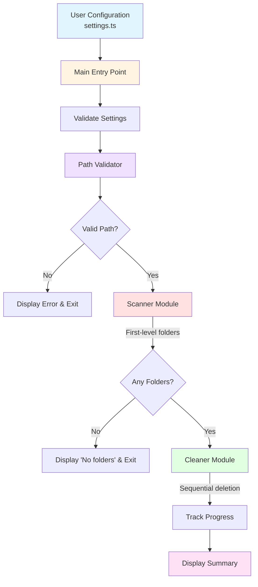
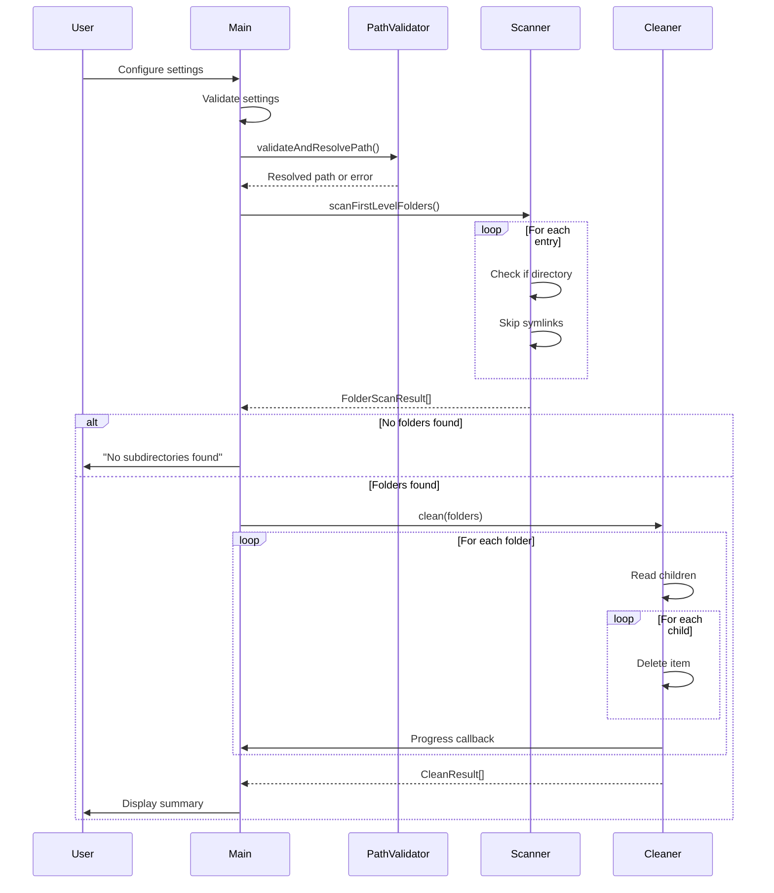

# Folders Cleaner

A powerful TypeScript CLI tool that clears all files from first-level subfolders while preserving the folder structure. Perfect for cleaning project directories, test outputs, or any folder structure where you want to keep the organizational hierarchy but remove the contents.

Built in March 2026. This CLI utility scans directories, removes files from immediate subfolders, preserves folder hierarchy, and provides safe, configurable cleanup for organized project maintenance and automation workflows.

## 🎯 Why Folders Cleaner?

Do you have folder structures you want to preserve but need to clear out all the files inside? This tool helps you:

- **Preserve Structure** - Keep your folder organization while removing all contents
- **Clean Efficiently** - Process multiple folders sequentially with clear progress tracking
- **Stay Safe** - Comprehensive path validation protects system directories
- **See Progress** - Real-time updates show exactly what's happening
- **Cross-Platform** - Works seamlessly on Mac, Linux, and Windows

## ✨ Features

- 🔍 **First-Level Scanning**: Scans only immediate subfolders (not recursive)
- 🗑️ **Content Deletion**: Removes all files and nested folders while preserving parent folders
- 🛡️ **Protected Paths**: Prevents cleaning of system directories (/, /etc, C:\Windows, etc.)
- 📊 **Progress Tracking**: Real-time progress display with folder counts
- ⚡ **Sequential Processing**: Processes folders one at a time for reliable error tracking
- 🔒 **Type-Safe**: Written in TypeScript with full type safety
- 🌍 **Cross-Platform**: Handles Mac, Linux, and Windows paths correctly
- 🧪 **Well-Tested**: Comprehensive test suite with vitest

## 📊 Architecture

### System Flow



### Module Interaction

```mermaid
graph LR
    A[PathValidator] -->|Resolved Path| B[Scanner]
    B -->|FolderScanResult[]| C[Cleaner]
    C -->|CleanResult[]| D[Main]
    D -->|Display| E[Console]
    F[FileUtils] -.->|Helpers| A
    F -.->|Helpers| B
    F -.->|Helpers| C

    style A fill:#bbdefb
    style B fill:#ffccbc
    style C fill:#c5e1a5
    style D fill:#fff59d
    style E fill:#e1bee7
    style F fill:#ffcdd2
```

### Data Flow



## 🚀 Installation

```bash
# Clone the repository
git clone https://github.com/orassayag/folders-cleaner
cd folders-cleaner

# Install dependencies
pnpm install

# Build the project
pnpm build
```

## ⚙️ Configuration

Edit `src/settings.ts` to configure the tool:

```typescript
export const settings: Settings = {
  targetPath: '/path/to/target',
};
```

### Cross-Platform Path Examples

**Mac/Linux:**

```typescript
targetPath: '/Users/username/projects/test';
targetPath: './relative/path';
targetPath: '../parent/path';
```

**Windows:**

```typescript
targetPath: 'C:/Users/username/projects/test'; // Forward slashes (recommended)
targetPath: 'C:\\Users\\username\\projects\\test'; // Escaped backslashes
targetPath: 'D:\\projects\\test';
targetPath: '.\\relative\\path'; // Relative path
```

**Note:** Use forward slashes even on Windows for simplicity - Node.js handles the conversion automatically.

## 📖 Usage

1. Edit `src/settings.ts` and set your target path
2. Run the tool:

```bash
pnpm start
```

### Example Output

```
🗑️  Folders Cleaner

Target: /Users/username/test-folders
Scanning first-level subdirectories...
Found 3 folders to clean

Cleaning folders...
Processing: [1/3] folder1...
Processing: [2/3] folder2...
Processing: [3/3] folder3...

✅ Successfully cleaned 3/3 folders
Total items deleted: 42

✅ Done!
```

## 🛡️ Safety Features

- ✅ **Protected paths** - Prevents cleaning system directories
- ✅ **Path validation** - Checks path exists, is a directory, and has permissions
- ✅ **Settings validation** - Ensures configuration is valid before execution
- ✅ **Error handling** - Graceful handling of permission errors and failures
- ✅ **Detailed logging** - Clear error messages for common issues

### Protected Paths

The tool automatically prevents cleaning of:

**Unix/Mac:**

- Root and system directories: `/`, `/etc`, `/usr`, `/bin`, `/System`, etc.
- Home directory and its parent
- Current working directory and its parents (up to 2 levels)

**Windows:**

- Drive roots: `C:\`, `D:\`, etc.
- System directories: `C:\Windows`, `C:\Program Files`, etc.
- User home directory and its parent
- Current working directory and its parents

## 🛠️ Development

### Available Scripts

```bash
# Run the tool
pnpm start

# Run tests
pnpm test

# Run tests in watch mode
pnpm test:watch

# Build the project
pnpm build

# Lint the code
pnpm lint

# Fix linting issues
pnpm lint:fix

# Check code formatting
pnpm prettier

# Fix formatting issues
pnpm prettier:fix
```

### Project Structure

```
folders-cleaner/
├── src/
│   ├── main.ts                    # Entry point
│   ├── settings.ts                # Configuration
│   ├── types/
│   │   └── index.ts              # Type definitions
│   ├── core/
│   │   ├── scanner.ts            # First-level scanning logic
│   │   ├── cleaner.ts            # Sequential deletion logic
│   │   └── __tests__/            # Core module tests
│   └── utils/
│       ├── pathValidator.ts      # Path validation & security
│       ├── fileUtils.ts          # File system utilities
│       └── __tests__/            # Utils tests
├── package.json
├── tsconfig.json
├── vitest.config.ts
└── README.md
```

## ⚙️ How It Works

1. **Settings Validation** - Ensures targetPath is configured (not empty or placeholder)
2. **Path Validation** - Validates path exists, is a directory, has permissions, and is not protected
3. **Scanner** - Scans only first-level subdirectories of target path
4. **Empty Check** - If no subdirectories found, exits with success message
5. **Cleaner** - For each first-level folder sequentially:
   - Reads immediate children (files, folders, symlinks)
   - Deletes each child using appropriate method
   - Tracks successful deletions
   - On error: marks folder as failed and continues
   - Preserves the parent folder itself
6. **Progress Display** - Shows current folder and completion ratio
7. **Summary** - Displays success/failure counts and total items deleted

## 📚 Example Scenarios

### Scenario 1: Clean Test Output Folders

```typescript
// settings.ts
export const settings: Settings = {
  targetPath: '/Users/username/projects/test-output',
};
```

**Before:**

```
test-output/
├── run-2024-01-01/
│   ├── logs/
│   │   └── test.log
│   └── results.json
├── run-2024-01-02/
│   └── data.json
└── run-2024-01-03/
    └── errors.txt
```

**After:**

```
test-output/
├── run-2024-01-01/  (empty)
├── run-2024-01-02/  (empty)
└── run-2024-01-03/  (empty)
```

### Scenario 2: Clean Multiple Project Folders

```typescript
// settings.ts
export const settings: Settings = {
  targetPath: './temp-projects',
};
```

This will clean all first-level folders in `temp-projects/` while preserving the folder structure.

### Scenario 3: Relative Path Usage

```typescript
// settings.ts
export const settings: Settings = {
  targetPath: '../archived/old-builds',
};
```

The tool automatically resolves relative paths to absolute paths.

## ⚡ Performance

The tool uses:

- **Sequential processing** for reliable error tracking
- **Async/await** with `fs.promises` for non-blocking I/O
- **Atomic deletion** with `fs.rm({ recursive: true })` for directories
- **Efficient counting** - counts only immediate children, not nested items

Typical performance: Processes folders quickly with minimal overhead.

## 🔧 Troubleshooting

### Configuration Errors

If you see "Configuration Required" error:

- Edit `src/settings.ts`
- Set `targetPath` to a valid path
- Ensure it's not the default placeholder `/path/to/target`

### Permission Errors

If you encounter permission errors:

- Ensure you have read/write access to the target directory
- On macOS/Linux, check folder permissions with `ls -la`
- On Windows, check folder properties

### Path Not Found

If the path doesn't exist:

- Verify the path is spelled correctly
- Use absolute paths for clarity
- Check if the folder exists with `ls` (Mac/Linux) or `dir` (Windows)

### Protected Path Error

If cleaning is blocked:

- The path is a protected system directory
- Choose a different, safer folder
- This is a safety feature to prevent system damage

## 🌍 Cross-Platform Support

The tool fully supports Windows, Mac, and Linux:

- **Path handling**: Uses Node.js `path` module for OS-specific operations
- **Path validation**: Detects and validates OS-specific path formats
- **Protected paths**: Different protected paths for each OS
- **Testing**: Tests cover both Unix and Windows path scenarios

### Windows Specific Notes

- Use forward slashes (`/`) or escaped backslashes (`\\`)
- Both `C:/path` and `C:\path` formats work
- UNC paths (`\\server\share`) are supported
- MAX_PATH limit (260 chars) may affect very long paths
- Reserved filenames (CON, PRN, AUX, NUL) cannot be deleted

## 🧪 Testing

The project includes comprehensive tests:

```bash
# Run all tests
pnpm test

# Run tests in watch mode
pnpm test:watch
```

**Test Coverage:**

- Unit tests for path validation (cross-platform)
- Unit tests for file utilities
- Unit tests for scanner module
- Unit tests for cleaner module
- Integration tests for full workflow
- Edge case handling (unicode, spaces, special characters)

## 📄 License

This project is licensed under the MIT License - see the LICENSE file for details.

## 🤝 Contributing

Contributions are welcome! Please read our [Contributing Guide](CONTRIBUTING.md) for details on our code of conduct and the process for submitting pull requests.

### Quick Start for Contributors

1. Fork the repository
2. Create your feature branch (`git checkout -b feature/AmazingFeature`)
3. Commit your changes (`git commit -m 'feat: add some amazing feature'`)
4. Push to the branch (`git push origin feature/AmazingFeature`)
5. Open a Pull Request

See [CONTRIBUTING.md](CONTRIBUTING.md) for detailed guidelines.

## 📚 Documentation

- [Contributing Guide](CONTRIBUTING.md) - How to contribute to this project
- [Developer Instructions](INSTRUCTIONS.md) - Detailed development documentation
- [Plan Document](docs/PLAN.md) - Original implementation plan

## 🙏 Acknowledgments

- Built with [TypeScript](https://www.typescriptlang.org/)
- Tested with [Vitest](https://vitest.dev/)
- Package management by [pnpm](https://pnpm.io/)

## 📧 Contact

Or Assayag - [@orassayag](https://github.com/orassayag)

Project Link: [https://github.com/orassayag/folders-cleaner](https://github.com/orassayag/folders-cleaner)

## ⭐ Show Your Support

Give a ⭐️ if this project helped you organize your folders!

---

**⚠️ WARNING**: This tool permanently deletes files and folders. The deletion is irreversible. Always:

- Double-check your `targetPath` configuration
- Ensure you have backups of important data
- Test with a non-critical directory first
- Understand that protected system paths are blocked for your safety

**The parent folders are preserved, but all their contents are permanently deleted.**

## License

This application has an MIT license - see the [LICENSE](LICENSE) file for details.
